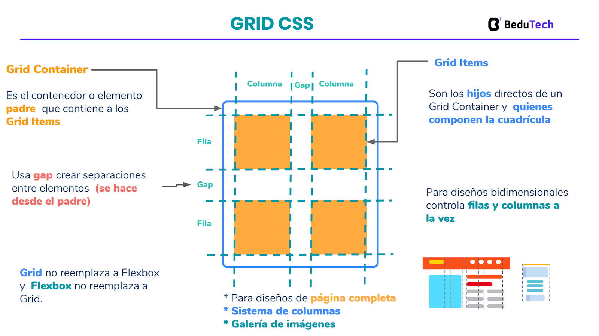

# Sesión 04: Agregando filas y columnas con CSS Grid

Sigue el contenido a continuación durante clase para que no te pierdas ningún
detalle de lo que estás a punto de aprender.

## Objetivos

En esta sesión aprenderás:

- Estructurar elementos en formato de filas y columnas.
- Posicionar elementos en base a la posición de otros de manera flexible.
- Usar comandos de git para obtener cambios realizados por terceros.

## Requisitos

- Git  instalado
- Navegador web
- Editor de código 
- Cuenta de Github

 

## Organización de la clase

- [Ejemplo 01: FlexBox](./Ejemplo-01)

- [Reto  01: FlexBox](./reto-01)

- [Ejemplo  02: Propiedades de alineación Flexbox](./Ejemplo-02)

- [Reto  02: Grid con 3 columnas iguales](./reto-02)

- [Ejemplo  03: Agregando características principales de Matcha](./Ejemplo-03)

- [Reto  03: Grid 2 filas con alto de `330px`](./reto-03)

- [Reto  04: Agregando el contenido de las tarjetas](./reto-04)

- [Postwork](./postwork)

 

# Grid CSS

El término **grid**, **cuadrícula** o **rejilla** en CSS hace referencia a la apariencia de filas y columnas que generan los elementos de CSS.

Anteriormente, para lograr esta apariencia solo teníamos los display de `inline-block` y propiedades como `float`, posteriormente con la aparición de Flexbox podíamos simular este comportamiento de manera flexible.

Sin embargo, no existía ninguna forma nativa dedicada a este formato que es muy común encontrar en las páginas web modernas.

 

 

Sin embargo, en CSS3 tenemos un **nuevo conjunto de propiedades** que nos permiten lograr este objetivo de una manera más práctica y sencillo, que toma el nombre de Grid CSS.

 

 